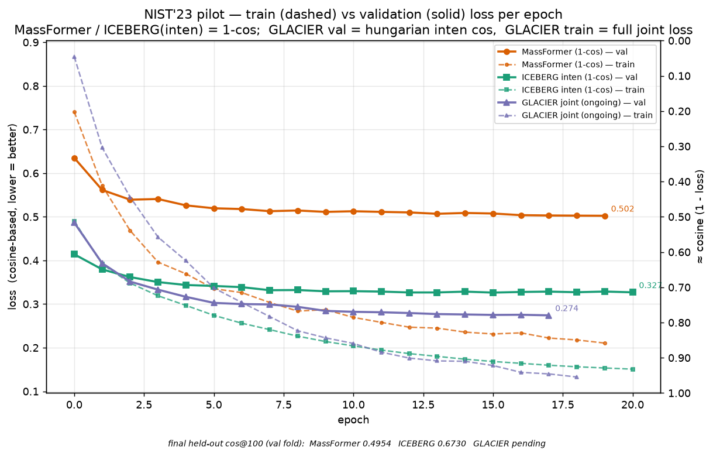

# NIST'23 pilot (fold-swapped) training — GLACIER / ICEBERG / MassFormer

Re-train three benchmark models on the **pilot fold-swapped** index and validate on the
held-out pilot val fold. This mirrors the MetaboAI Stage-2 "fragment-as-latent" pilot so
the ms-pred baselines sit on the same records.

> Supersedes the discarded `sub4k` index (whose val was only 328 specs / 114 molecules
> after `--max-val 2000` truncation — too small to compare).

## What the index is (folds swapped)

Source: `data/pilot_index.tar.gz` (index only — which records, no spectra).

| pilot fold | source | records | specs | molecules |
|---|---|---:|---:|---:|
| **train** | official scaffold_1 **val** fold (entire) | 107,379 | 17,371 | 5,205 |
| **val**   | slice of official scaffold_1 **train** fold (2 CE / molecule) | 6,000 | 4,971 | 3,000 |

- **No test fold** — the pilot does not use test; the final number is the **val** score.
- Swapping folds buys molecule diversity (5,205 vs the old 4,041, +29%) and keeps val cheap
  to score often. Scaffold separation is automatic (the two sets are opposite sides of the
  official scaffold split): train/val record, spec, and **molecule** intersections are all 0.
- **pilot ≠ full**: the pilot val comes from the official *train* fold, so it overlaps the
  full run's training set. This is intentional; never put pilot and full numbers on one axis.

## Files added

- Train split: `data/spec_datasets/nist23/splits/pilot_swapped_scaffold_1.tsv` (`spec`, `Fold_0` = train/val)
- Eval split:  `data/spec_datasets/nist23/splits/pilot_swapped_scaffold_1_valeval.tsv`
  (the pilot **val** relabelled as `test` so ms-pred's `--subset-datasets test_only` selects
  exactly those 4,971 specs — there is no `val_only` option in the predict scripts, and no
  code change is needed)
- Configs (`split-name` + `save-dir` [+ chained paths] changed vs the baselines):
  - `configs/massformer/nist23/massformer_baseline_nist23_pilot.yaml`
  - `configs/glacier/nist23/joint_train_nist23_pilot.yaml`
  - `configs/iceberg/nist23/dag_train_nist23_pilot.yaml`
  - `configs/iceberg/nist23/dag_gen_predict_train_nist23_pilot.yaml`
  - `configs/iceberg/nist23/dag_inten_train_nist23_pilot.yaml`
- Drivers (train → predict val → eval): `run_scripts/nist23_benchmark/pilot/run_{massformer,glacier,iceberg}_pilot.sh`

All outputs go to `results/<model>_nist23/**pilot_rnd1**/`, keeping the full-train
baselines at `scaffold_1_rnd1/` untouched.

## Run

```bash
bash run_scripts/nist23_benchmark/pilot/run_massformer_pilot.sh   # GPU 4
bash run_scripts/nist23_benchmark/pilot/run_glacier_pilot.sh      # GPU 5, single-GPU
bash run_scripts/nist23_benchmark/pilot/run_iceberg_pilot.sh      # GPU 6 (gen-predict 6,7)
```

Each driver trains on the pilot train/val split, predicts the **val** fold
(`--subset-datasets test_only` on the val-as-test split), and evaluates via
`analysis/spec_pred_eval.py` (`--max-peaks 100 --min-inten 0`, gold `no_subform.hdf5`),
writing `results/<model>_nist23/pilot_rnd1/preds_val/pred_eval.yaml`.

### Notes
- GLACIER is single-GPU (avoids the multi-GPU RAM-OOM / lr-scheduler gotchas).
- Predict scripts take `--checkpoint-pth` (the repo's `0X_predict.py` drivers pass the old
  `--checkpoint` and are stale).
- Two code fixes were needed for the no-test-fold pilot (both no-ops for normal splits):
  train scripts skip the test dataset when the split has no test fold; `spec_pred_eval.py`
  reads MassFormer's PredSpecDB binned output (3-tuple `get_all_specs`, `binned_spec`
  instead of `intens`, CE taken from the per-CE MassSpec rather than parsed from the name).
- Val eval is at **spec level** (all CEs of the 4,971 val specs). To match the pilot's exact
  6,000 (spec, CE) records instead, filter with `pilot_keys_val.txt`.

## Results (pilot **val** fold, 4,971 specs)

Filled in after eval completes.

| Model | cosine | entropy | coverage |
|---|---:|---:|---:|
| GLACIER (pilot) | _pending_ | _pending_ | _pending_ |
| ICEBERG (pilot) | 0.6730 | 0.6207 | 0.8051 |
| MassFormer (pilot) | 0.4954 | 0.4748 | 0.7229 |

Compare pilot-to-pilot only; the published scaffold_1-test baselines (GLACIER 0.800 /
ICEBERG 0.722 / MassFormer 0.512) are a different set and not directly comparable.

## Training curves

Per-epoch **train (dashed) vs validation (solid)** loss, one colour per model
(cosine-based, lower = better):



- Data: `pilot_val_loss.tsv` (small, version-controlled; columns `model, epoch, split, loss`).
  Figure: `plot_loss_curves.py`.
- Regenerate from the TSV: `python plot_loss_curves.py`
  Re-extract from training stdout logs: `python plot_loss_curves.py --logs <dir-with-{model}_pilot.log>`
- MassFormer / ICEBERG(inten) losses are `1-cos` on the binned spectrum, so the right axis
  (`1-loss`) tracks the held-out cos@100 closely (val: MassFormer 0.502→0.4954, ICEBERG 0.327→0.6730).
- The train–val gap is the generalization gap (train < val): MassFormer 0.21 vs 0.50, ICEBERG
  0.15 vs 0.33. **GLACIER's train loss is the full joint objective** (intensity + 0.1·fragment,
  magma-blended) while its **val loss is the hungarian intensity cos** — different quantities, so
  GLACIER's train/val gap is not a like-for-like generalization gap. GLACIER is still training in
  this snapshot — refresh after it finishes.
